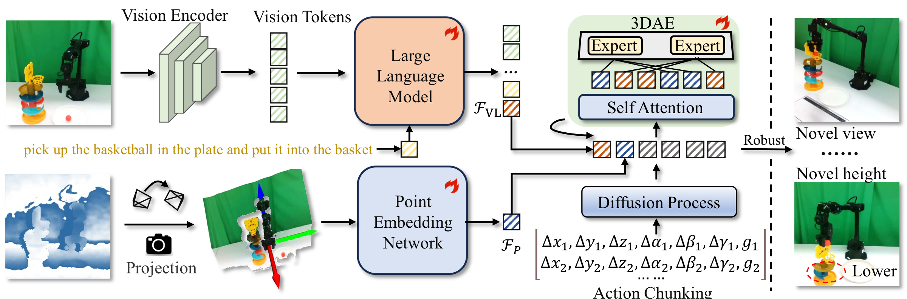
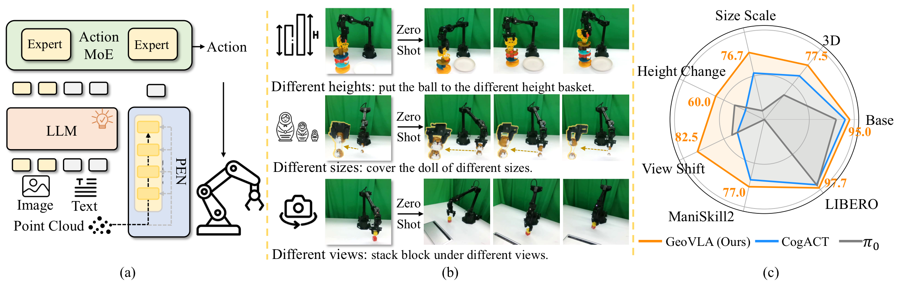

# GeoVLA: Empowering 3D Representations in Vision-Language-Action Models （IROS 2026）

GeoVLA is a vision-language-action framework for robotic manipulation that augments image-language policy learning with explicit 3D geometry. The repository contains training, fine-tuning, and deployment code for the GeoVLA implementation in this workspace.



The paper evaluates GeoVLA in simulation and real-world manipulation settings, with an emphasis on 3D-aware generalization such as height changes, object-size changes, and camera-viewpoint shifts.



### Core Simulation Results

**LIBERO success rate.** GeoVLA uses a single RGB-D camera and achieves the strongest average performance across the evaluated LIBERO suites.

| Method | Spatial | Object | Goal | Long | LIBERO-90 | Avg. |
| --- | ---: | ---: | ---: | ---: | ---: | ---: |
| OpenVLA | 84.7 | 88.4 | 79.2 | 53.7 | 73.5 | 75.9 |
| SpatialVLA | 88.2 | 89.9 | 78.6 | 55.5 | 46.2 | 71.7 |
| pi0-FAST* | 96.4 | 96.8 | 88.6 | 60.2 | 83.1 | 85.0 |
| pi0* | 96.8 | 98.8 | 95.8 | 85.2 | - | 94.2 |
| CogACT | 97.2 | 98.0 | 90.2 | 88.8 | 92.1 | 93.2 |
| OpenVLA-OFT* | 96.2 | 98.3 | 96.2 | 90.7 | - | 95.3 |
| **GeoVLA** | **98.4** | **99.0** | **96.6** | **96.6** | **97.7** | **97.7** |

**ManiSkill2 success rate.** GeoVLA improves the average success rate on pick-and-place tasks, especially under clutter and object diversity.

| Method | PickCube | StackCube | PickSingleYCB | PickSingleEGAD | PickClutterYCB | Avg. |
| --- | ---: | ---: | ---: | ---: | ---: | ---: |
| OpenVLA* | 65 | 55 | 0 | 15 | 0 | 27 |
| Dita | 79 | 80 | 62 | 72 | 36 | 66 |
| CogACT* | 95 | 90 | 65 | 75 | 25 | 69 |
| **GeoVLA** | **90** | **90** | **75** | **85** | **45** | **77** |

### Core Real-World Results

GeoVLA is evaluated on basic manipulation tasks and 3D-aware tasks using a WidowX-250s arm with a RealSense-435i depth camera. Each task is evaluated over 10 independent trials.

| Method | P-Carrot | S-Block | S-Cup | I-Circle | H-Cup | P-Basketball | C-Matryoshka | P-Hairclip | Avg. |
| --- | ---: | ---: | ---: | ---: | ---: | ---: | ---: | ---: | ---: |
| OpenVLA | 50 | 10 | 40 | 30 | 0 | 20 | 10 | 0 | 20.0 |
| pi0 | 100 | 50 | 90 | 80 | 50 | 40 | 50 | 0 | 57.5 |
| CogACT | 100 | 80 | 100 | 80 | 50 | 60 | 70 | 70 | 76.3 |
| **GeoVLA** | **100** | **80** | **100** | **100** | **70** | **90** | **70** | **80** | **86.3** |

GeoVLA also tests inference-time variation settings, including basket height changes in `P-Basketball`, doll size changes in `C-Matryoshka`, camera viewpoint changes in `S-Block`, and object height changes in `P-Carrot`.

## Installation

The code targets Python 3.10 with PyTorch 2.2+ and CUDA 12+. Earlier Python 3.8+ environments may work, but are not the primary target.

```bash
conda create --name geovla python=3.10
conda activate geovla
pip install -e .
```

Training also uses FlashAttention:

```bash
pip install packaging ninja
ninja --version
pip install "flash-attn==2.5.5" --no-build-isolation
```

## Simulation Tasks

This repository keeps simulation fine-tuning support for LIBERO and ManiSkill through the RLDS/OXE registry in `prismatic/vla/datasets/rlds/oxe/`.

LIBERO datasets are registered as task-family mixtures:
`libero_90_with_state_wrist_pc`: LIBERO subsets with state, wrist RGB, and wrist/base point-cloud observations.
- `libero_all_with_state_wrist_pc`: mixture of LIBERO-10, LIBERO-90, LIBERO-Goal, LIBERO-Spatial, and LIBERO-Object variants with wrist point clouds.
- `libero_all_state_pc_no_noop`: mixture of LIBERO-10/90/Goal/Object/Spatial variants using base point clouds and no-op removal.

ManiSkill datasets are registered around the following manipulation tasks:

- `pick_cube`
- `stack_cube`
- `pick_single_ycb`
- `pick_single_egad`
- `pick_clutter_ycb`

The ManiSkill registry includes RGB-only mixtures such as `agg_maniskill`, depth variants such as `agg_maniskill_with_state_wrist_depth_tcp`, point-cloud variants such as `agg_maniskill_with_state_wrist_pc_tcp`, and goal/state point-cloud variants such as `agg_maniskill_pcd_goal_state`.

Use `--vla.data_mix` to select one of these registered mixture names. The matching dataset config controls whether the loader expects RGB only, wrist images, raw depth, point clouds, state, goal, or TCP/proprio fields.

## Real-World Tasks

The GeoVLA paper evaluates real-world manipulation tasks that stress both basic grasping and 3D-aware generalization:

- `P-Carrot`: pick carrot.
- `S-Block`: stack block.
- `S-Cup`: stack cup.
- `I-Circle`: insert circle.
- `H-Cup`: hang cup.
- `P-Basketball`: put basketball into a basket.
- `C-Matryoshka`: cover or assemble a Matryoshka doll.
- `P-Hairclip`: pick hairclip.

The real-world variation tests focus on geometry-related distribution shifts:

- Basket height changes in `P-Basketball`.
- Doll size changes in `C-Matryoshka`.
- Camera viewpoint changes in `S-Block`.
- Removing the sponge mat in `P-Carrot`, which changes the carrot height.

## Fine-Tuning

Fine-tuning is run with PyTorch FSDP. The standard entry point is `scripts/train.py`, with experiment defaults registered in `conf/vla.py`. For training from scratch in this project, initialize from the OpenVLA Prismatic checkpoint, for example `openvla-7b-prismatic/checkpoints/step-295000-epoch-40-loss=0.2200.pt`.

```bash
torchrun --standalone --nnodes 1 --nproc-per-node 8 scripts/train.py \
  --pretrained_checkpoint /path/to/openvla-7b-prismatic/checkpoints/step-295000-epoch-40-loss=0.2200.pt \
  --vla.type prism-dinosiglip-224px+oxe+diffusion \
  --vla.data_mix <dataset_mix> \
  --vla.expected_world_size 8 \
  --vla.global_batch_size 256 \
  --vla.per_device_batch_size 32 \
  --vla.learning_rate 2e-5 \
  --data_root_dir <path_to_dataset_dir> \
  --run_root_dir <path_to_logs_and_checkpoints> \
  --run_id <run_name> \
  --image_aug False \
  --wandb_project geovla \
  --save_interval 2500 \
  --repeated_diffusion_steps 8 \
  --future_action_window_size 15 \
  --action_model_type DiT-B \
  --is_resume False \
  --load_depth True \
  --depth_type dit_condition_self \
  --dit_moe True \
  --proprio_type <proprio_type> \
  --load_wrist False \
  --wrist_first False
```

For custom data, convert trajectories to RLDS format and point `--data_root_dir` to the converted dataset. The expected action format is end-effector delta translation, rotation, and gripper action.

### Training Script Templates

The shell scripts in `scripts/` are templates around the same training entry point, `scripts/train.py`. They mainly differ in the data mixture and 3D-conditioning flags:

- `scripts/train_base.sh`: baseline fine-tuning template. It keeps `--load_depth False` and `--depth_type none`, so training uses RGB/language plus any configured state or goal inputs. The active block currently targets ManiSkill `pick_cube_pcd_goal_state`; commented blocks show the same pattern for WidowX-style real data and LIBERO.
- `scripts/train_3d.sh`: 3D fine-tuning template. It enables `--load_depth True` and uses `--depth_type dit_condition_self`, so depth or point-cloud observations are passed through the point-cloud encoder and used by the DiT action path. The active block currently targets the real-data mixture `x14_shift_task`; commented blocks show ManiSkill and LIBERO 3D variants.
- `scripts/train_3d_moe.sh`: 3D MoE fine-tuning template. It is the 3D setup plus `--dit_moe True`, enabling the MoE variant in the DiT action model. The active block currently fine-tunes on `libero_fun_state_pc_no_noop` from a previous GeoVLA checkpoint.

All three scripts require `HF_TOKEN` to be set in the environment and use local cache/output paths that should be changed for a new machine. For quick syntax/debug runs, pass `--debug` to reduce the distributed sizes and disable W&B logging.

## Depth, Camera Parameters, and RLDS Data

Depth is only used when `--load_depth` is enabled and the selected dataset config exposes a depth or point-cloud key. The RLDS loader maps configured fields into `observation.depth_primary` and, when wrist input is enabled, `observation.depth_wrist`. In `RLDSBatchTransform`, these arrays are passed to the model as `{"pc": depth_primary}` and optionally `{"pc_wrist": depth_wrist}`.

GeoVLA accepts two practical 3D data forms:

- Raw depth: shape `[H, W, 1]`, in meters after dataset preprocessing. `DiTDepthEncoder.depth_preprocess` converts it to XYZ points using camera parameters.
- Precomputed point cloud: shape `[H, W, 3]`, already expressed in the robot/world frame expected by training. In this case the loader treats it directly as point-cloud coordinates.

Camera intrinsics and extrinsics are handled differently for offline training and real deployment:

- For offline RLDS training, the most robust option is to save precomputed point clouds as `base_pc` and `wrist_pc` in the dataset, then register those keys in the OXE dataset config. This avoids relying on hard-coded camera calibration during training.
- If raw depth is stored instead, save depth as `base_depth` and `wrist_depth`, and make sure the matching camera extrinsic can be recovered. When `--proprio_type` contains `extrinsic`, the last two values of `observation.proprio` are parsed as extrinsic IDs; these IDs are looked up through `EXTRINSIC_INDEX` in `vla/extrinsic.py`.
- In real-robot serving, `scripts/real_deploy.py` stores camera intrinsics and several calibrated extrinsic matrices in code. The `/camera/<camera_id>` endpoint selects the active extrinsic. Incoming depth is expected as uint16 millimeters with shape `480 x 640`, converted to meters, projected to point cloud with `INTRINSICS` and the selected extrinsic, cropped/resized to `224 x 224`, and optionally centered by the current end-effector position when `shift_ee` is in `--proprio_type`.

For a custom RLDS dataset, each step should provide the fields that match the dataset config in `prismatic/vla/datasets/rlds/oxe/configs.py`:

- RGB observation: a primary image, usually registered as `image`, and optional wrist image such as `wrist_image`.
- 3D observation: either raw depth (`base_depth`, optional `wrist_depth`) or point cloud (`base_pc`, optional `wrist_pc`). These are mapped by the config to `depth_primary` and `depth_wrist`.
- Language: `task.language_instruction`, stored as the natural-language command for the step.
- Action: future action chunks are supported; with `--future_action_window_size 15`, each sample trains on 16 actions including the current step. The action convention is delta end-effector translation, rotation, and gripper.
- Proprioception: `observation.proprio` is required when `--proprio_type` is not `none`. The transform first reads the robot state, then strips optional suffixes according to `--proprio_type`: last 3 values for `goal`, last 2 values for `extrinsic`, and the first 3 state values as the end-effector center for `shift_ee`.

After adding a new dataset config, register its mixture in `prismatic/vla/datasets/rlds/oxe/mixtures.py` and select it with `--vla.data_mix <mixture_name>`. Keep `--load_depth`, `--load_wrist`, `--wrist_first`, `--depth_type`, and `--proprio_type` aligned with the fields actually present in the RLDS data.

### Important Training Parameters

The most important parameters are the ones that change data semantics, model shape, or checkpoint compatibility:

- `--pretrained_checkpoint`: starting weights. New GeoVLA training should initialize from the local OpenVLA Prismatic checkpoint; resume runs should use a saved GeoVLA checkpoint with `--is_resume True`.
- `--vla.type`: registered model/config name from `conf/vla.py`. The default GeoVLA-style setup here is `prism-dinosiglip-224px+oxe+diffusion`.
- `--vla.data_mix`: dataset mixture name from the RLDS/OXE registry. This must match a key in `prismatic/vla/datasets/rlds/oxe/mixtures.py`.
- `--data_root_dir`: root directory containing the converted RLDS datasets referenced by the selected mixture.
- `--future_action_window_size`: action chunk horizon. With `15`, the model trains on 16 actions including the current step, so deployment should use a compatible action horizon.
- `--action_model_type`: DiT action head size, such as `DiT-S`, `DiT-B`, or `DiT-L`. This must match the checkpoint architecture.
- `--repeated_diffusion_steps`: number of diffusion samples repeated per training item. This affects diffusion-head training cost and gradient signal.
- `--load_depth`: enables loading `depth_primary` / `depth_wrist` from RLDS and passing them into the 3D branch.
- `--depth_type`: selects where 3D features are fused. Current scripts mainly use `dit_condition_self`; other code paths include VLM conditioning and DiT cross-conditioning variants.
- `--proprio_type`: defines how `observation.proprio` is parsed. Tokens such as `goal`, `extrinsic`, `shift_ee`, `vlm_condition`, and `@N` change which suffixes are stripped and how many state dimensions are used.
- `--load_wrist`: enables wrist RGB/depth inputs when the dataset config provides them.
- `--wrist_first`: changes camera ordering for both RGB and point-cloud dictionaries; keep it consistent between training and inference.
- `--dit_moe`: enables the MoE variant of the DiT action model. Checkpoints trained with this flag are not interchangeable with the non-MoE DiT head.

Other run-control settings are ordinary experiment-management knobs. Adjust them for hardware and logging, but they do not define the data format or model architecture.

## 3D Conditioning

GeoVLA can use depth-derived geometry through the existing `depth_type` and `proprio_type` options in the training scripts:

- `depth_type` controls whether point-cloud information conditions the VLM token path, the DiT action path, or both.
- `proprio_type` controls additional robot state or goal conditioning.
- `modules/fusion_module.py` provides cross-fusion for point-cloud features.
- `vla/modules.py` contains the depth encoders used by the policy.

The paper-level architecture maps to this implementation as:

- RGB and instruction processing: `prismatic/models/vlms/` and `vla/geovlavla.py`.
- Point-cloud embedding path: `vla/modules.py` plus the depth preprocessing hooks.
- 3D-aware action generation: `action_model/` and the cross-condition logic in `GeoVLA`.

## Deployment

The repository includes an HTTP-style deployment script for local robot clients:

```bash
python scripts/real_deploy.py \
  --saved_model_path /path/to/geovla/checkpoints/step-xxxxx-epoch-xx-loss=x.xxxx.pt \
  --unnorm_key <unnorm_key> \
  --action_ensemble \
  --use_bf16 \
  --action_ensemble_horizon 2 \
  --adaptive_ensemble_alpha 0.1 \
  --cfg_scale 1.5 \
  --port 5500
```

See `scripts/real_deploy.py` for concrete request/response formats and robot-specific preprocessing.

### Important Deployment Parameters

- `--saved_model_path`: local GeoVLA checkpoint or model directory served by the policy server. This should be a checkpoint produced by your training run, not a hosted model id.
- `--unnorm_key`: action normalization key matching the fine-tuning dataset statistics.
- `--cfg_scale`: classifier-free guidance scale for diffusion action sampling. Larger values strengthen conditioning but can reduce smoothness.
- `--use_ddim`: enables DDIM sampling for faster deterministic action generation.
- `--num_ddim_steps`: number of DDIM denoising steps; fewer steps are faster, more steps can improve quality.
- `--use_bf16`: casts the VLM to bfloat16 to reduce memory use.
- `--action_ensemble`: enables temporal action ensembling for smoother robot control.
- `--action_ensemble_horizon`: number of recent action chunks used by the ensemble.
- `--adaptive_ensemble_alpha`: temporal weighting factor for adaptive ensembling.
- `--port`: server port for inference requests.
- `--load_depth`, `--depth_type`, and `--proprio_type`: must match the model architecture and training setup.

## Acknowledgements

This codebase is built on top of the [CogACT](https://cogact.github.io/) codebase. We sincerely thank the CogACT authors for releasing their implementation and providing a strong foundation for VLA policy learning.

## Citation

If you find GeoVLA useful for your research, please cite:

```bibtex
@inproceedings{sun2026geovla,
  title     = {GeoVLA: Empowering 3D Representations in Vision-Language-Action Models},
  author    = {Sun, Lin and Xie, Bin and Liu, Yingfei and Shi, Hao and Wang, Tiancai and Cao, Jiale},
  booktitle = {Proceedings of the IEEE/RSJ International Conference on Intelligent Robots and Systems (IROS)},
  year      = {2026}
}
```
